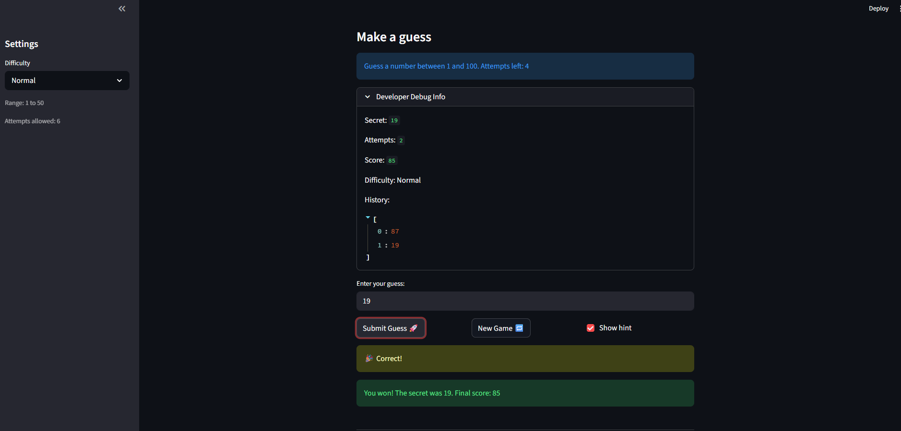

# 🎮 Game Glitch Investigator: The Impossible Guesser

## 🚨 The Situation

You asked an AI to build a simple "Number Guessing Game" using Streamlit.
It wrote the code, ran away, and now the game is unplayable. 

- You can't win.
- The hints lie to you.
- The secret number seems to have commitment issues.

## 🛠️ Setup

1. Install dependencies: `pip install -r requirements.txt`
2. Run the broken app: `python -m streamlit run app.py`

## 🕵️‍♂️ Your Mission

1. **Play the game.** Open the "Developer Debug Info" tab in the app to see the secret number. Try to win.
2. **Find the State Bug.** Why does the secret number change every time you click "Submit"? Ask ChatGPT: *"How do I keep a variable from resetting in Streamlit when I click a button?"*
3. **Fix the Logic.** The hints ("Higher/Lower") are wrong. Fix them.
4. **Refactor & Test.** - Move the logic into `logic_utils.py`.
   - Run `pytest` in your terminal.
   - Keep fixing until all tests pass!

## 📝 Document Your Experience

- [x] Describe the game's purpose.
- [x] Detail which bugs you found.
- [x] Explain what fixes you applied.
# The Game Purpose:
The game’s purpose is to challenge the player to find a hidden number within a limited number of attempts, using higher/lower feedback after each guess. It also serves as a debugging and learning exercise by showing how small logic and state mistakes can break gameplay in a Streamlit app. In short, it is both a playable guessing game and a hands-on investigation into fixing AI-generated code.
# Bugs Found
   - The History lags by 1, instead of updating immediately
   - The hint is flipped: it says lower when it should say higher
   - The number of attempts does not update on the first submit.  -Both history and attempts do not update unless you click a button (example toggle btw show hint). Attempts left should start counting from 8. (Check line 95 for app.py)
   - Scoring is unpredictable. I should be able to tell if I am making progress or not
   - Difficulty levels: Hard and Normal tend to be reversed in number of potential guesses
   - The New Game button does not effectively start a new game

# Fixes
   - I moved the secret number into session state and only re-generated it when the New Game button is pressed, instead of creating a new random value during normal reruns.
   - Refactored to separate the logic from the app layout and UI.
   - Fixed the Check_guess function by reversing the message displayed
   - Fixed the Update_score function by removing the attempt_number offset, and removing the parity partiality for scoring
   - Fixed the attempts number tracking: initialise it to 0, instead of 1. Then parse attempts - 1 to update_Score
   - Fixed the New Game Button: New Game" doesn't reset everything — it only resets attempts and secret, leaving history, score, and status from the previous game intact. Fixed the high/low bug to handle for different difficulty levels
   - Rendered the debug panel after handling submit. We kept the same screen layout and made the attempts/debug info refresh immediately after you click Submit so the numbers no longer lag.
Changed difficulty levels mapping to attempts to model binary search and difficulty. 

## 📸 Demo

- [ ] [Insert a screenshot of your fixed, winning game here]

## 🚀 Stretch Features

- [ ] [If you choose to complete Challenge 4, insert a screenshot of your Enhanced Game UI here]
